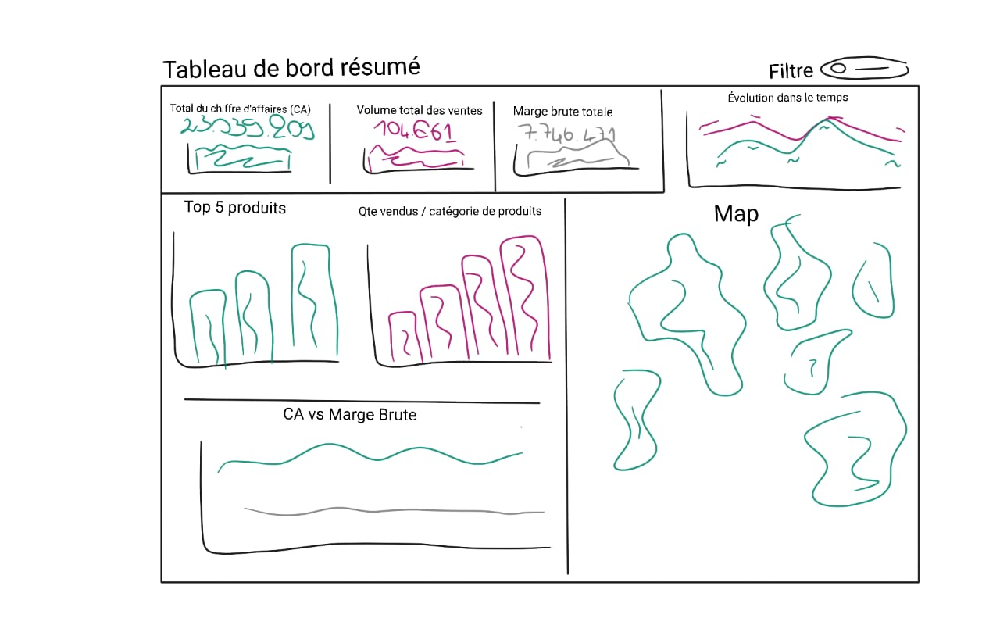
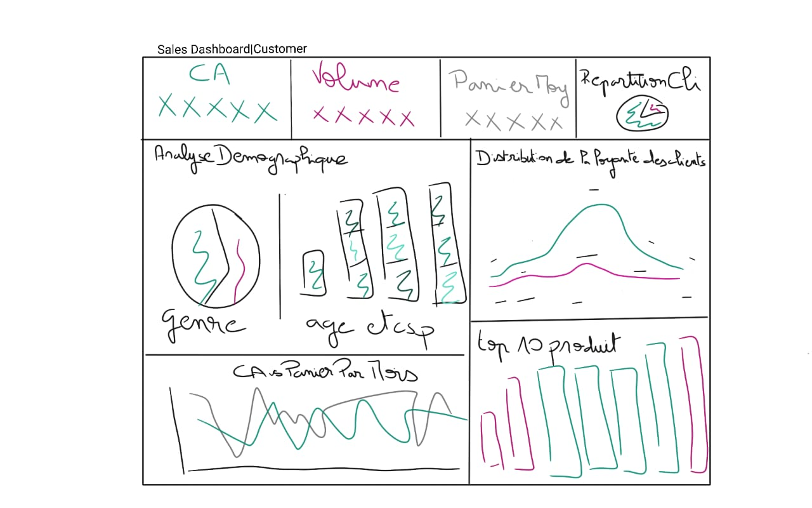
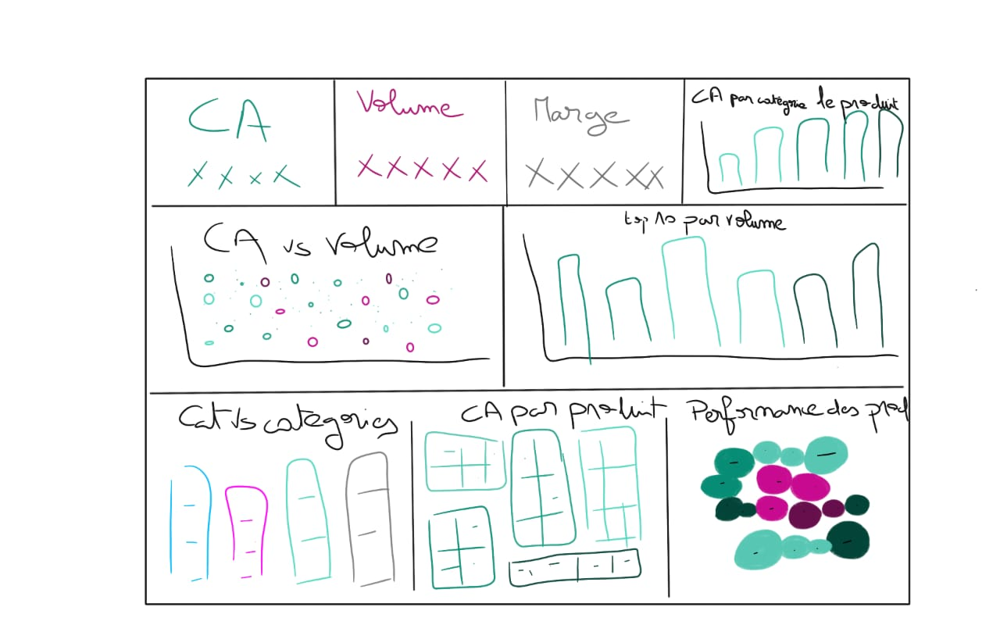
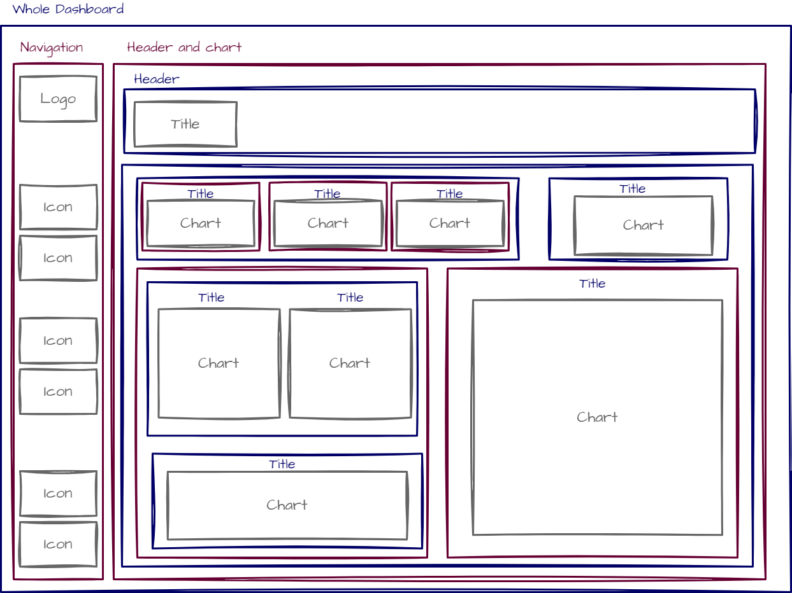
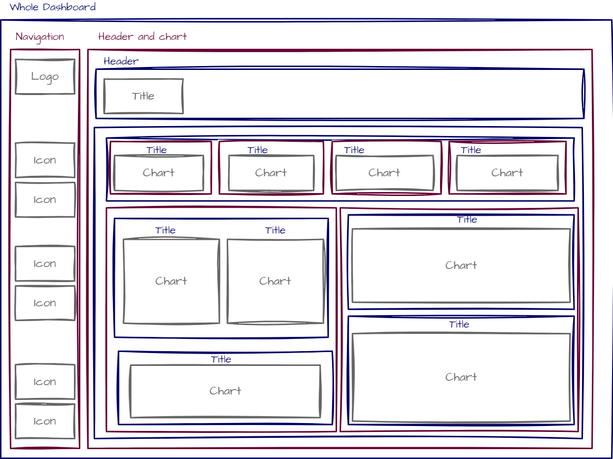
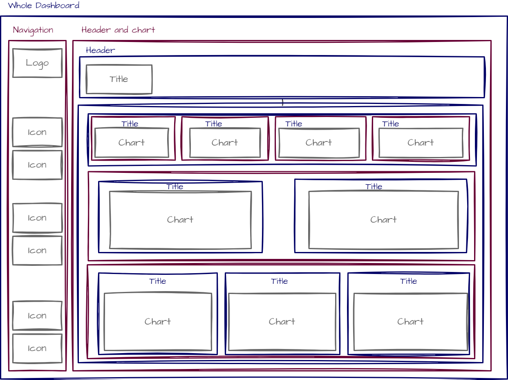

# Analyse et Visualisation des Ventes (End-to-End)

## Description
Ce projet illustre une solution complète et intégrée pour l'analyse des ventes, comprenant la génération de données, la préparation et la modélisation des données, la création de visualisations interactives, ainsi que la planification et la conteneurisation pour une présentation efficace. Le projet suit un flux de travail structuré qui garantit des résultats exploitables à chaque étape du processus. **Les données utilisées dans ce projet sont entièrement fictives et générées à des fins de démonstration.**
---

## 🎨 **Maquettes et Conception**
Voici les maquettes utilisées pour concevoir le tableau de bord :

### 🔹 Vue d'ensemble du Dashboard


### 🔹 Analyse des Clients


### 🔹 Performances des Produits


---

## 📦 **Plan de Conteneurisation**
Le projet est conteneurisé avec Docker pour une meilleure gestion :

### 🔹 Vue d'ensemble du Dashboard


### 🔹 Analyse des Clients


### 🔹 Performances des Produits


---
## Étapes principales du projet

### 1. Génération des données
- Utilisation du script Python `data_generation.py` pour produire un ensemble de données fictives simulant des ventes réelles.
- Ces données incluent des informations sur les clients, les produits, et les transactions, offrant une base pour des analyses approfondies.

### 2. Préparation et modélisation des données
- **Tableau Prep** : Transformation et structuration des données via Tableau Prep pour assurer leur cohérence et leur qualité, ainsi que leur modélisation en schéma étoile. Cette étape garantit une base solide pour l'analyse et facilite l'intégration dans des tableaux de bord avancés.
- Création de champs calculés pour enrichir les données, comme des métriques clés (exemple : marge brute, tranche d'age, loyauté).

### 3. Étude et conceptualisation
- Analyse des besoins du projet pour déterminer les objectifs et identifier les KPI (indicateurs clés de performance).
- Élaboration de maquettes détaillées (`Sales_review_mockup.jpg`, `Sales_customers_mockup.jpg`, `Sales_products_mockup.jpg`) pour visualiser les attentes avant la phase de développement.

### 4. Planification de la conteneurisation
- Définition d'une structure pour l'organisation des visualisations et des tableaux de bord dans un format modulaire et réutilisable.

### 5. Création des visualisations et des tableaux de bord
- **Tableau Desktop** : Développement de tableaux de bord interactifs dans le fichier `Sales_Dash.twb`.
  - Intégration des données préparées depuis `Output.hyper`.
  - Mise en place de visualisations dynamiques pour explorer les tendances des ventes, les performances des produits, et les segments de clientèle.

## Contenu du projet
- **Scripts** :
  - `data_generation.py` : Génération des données brutes fictives.
- **Données** :
  - `Output.hyper` : Fichier de données Tableau utilisé pour alimenter les visualisations.
- **Maquettes et plans** :
  - `Sales_review_mockup.jpg`, `Sales_customers_mockup.jpg`, `Sales_products_mockup.jpg`.
  - `Customer_Plan.png`, `Summary_Plan.png`, `ProductPlan.png`.
- **Visualisations** :
  - `Sales_Dash.twb` : Tableaux de bord interactifs développés dans Tableau.

## Pré-requis
- **Python 3.x** : Pour exécuter le script de génération des données.
- **Tableau Prep & Tableau Desktop** : Pour la préparation et la visualisation des données.
- **Microsoft PowerPoint** : Pour visualiser la présentation.

## Instructions pour utiliser le projet

### 1. Cloner le dépôt
```bash
# Clonez ce dépôt GitHub
git clone https://github.com/Aya1311/Analyse_et_Visualisation_des_Ventes_End-to-End
cd Analyse_et_Visualisation_des_Ventes_End-to-End
```

### 2. Génération et préparation des données
1. Exécutez le script pour générer les données :
   ```bash
   python data_generation.py
   ```
2. Préparez les données dans Tableau Prep et exportez le fichier au format `.hyper`.

### 3. Création et exploration des visualisations
1. Ouvrez `Sales_Dash.twb` dans Tableau Desktop.
2. Connectez les tableaux de bord au fichier `Output.hyper`.
3. Explorez les tableaux de bord interactifs pour analyser les performances des ventes.

## Auteur
Aya Laadaili
---
